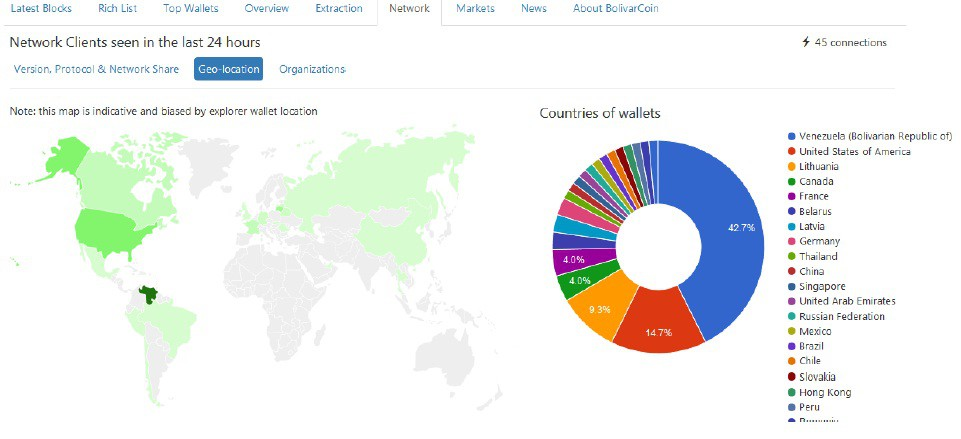

   

 <h1>Libro blanco de Bolivarcoin</h1> 

## Declaración:

BOLIVARCOIN ES UNA PLATAFORMA DESCENTRALIZADA Y DINAMICA EN CONSTANTE EVOLUCION. ESTE DOCUMENTO ES LA EXPRESION DE UNA PARTE DE LA COMUNIDAD DE BOLIVARCOIN SIN QUE REPRESENTE UNA AUTORIDAD UNICA YA QUE SU NATURALEZA RADICA EN LA DESCENTRALIZACION. ESTA INFORMACION ESTA ABIERTA A MODIFICACIONES QUE AGREGUEN VALOR E INFORMACION VALIOSA.

## 1. Introducción:

En la economía global los comercios siempre han ido en constantes olas de cambios, adaptándose como es conocido a nuevos mecanismos de compra-venta, y a su vez que puedan brindar a los individuos una mayor transparencia, seguridad y confianza posible. En la actualidad ha surgido con gran impulso una nueva tendencia, la cual se hace cada día más notoria en el argot de las divisas y los intercambios, Las criptomonedas.

Las criptomonedas son monedas virtuales que utilizan un cifrado digital para sus operaciones, lo que las hace más seguras y otorgando mayor privacidad a sus usuarios. Se caracterizan por ser descentralizadas, pues no responden al control de ningún país o institución, por lo que se pueden realizar transacciones sin necesidad de intermediarios. Desde su aparición en el presente siglo XXI, se han adoptado como una herramienta sencilla para las transacciones financieras, solucionando con rapidez, seguridad y confianza, zonas que los sistemas financieros tradicionales, no han podido cubrir o satisfacer.

Estas criptomonedas se gestionan a través de una base de datos llamada “blockchain” o Cadena de Bloques, que es un registro compartido y digitalizado que no puede modificarse una vez que una transacción ha sido registrada y verificada, Por otra parte, cada dispositivo que integre la red mantienen una copia del registro (es decir, la cadena de bloques), siendo esto prácticamente imposible de modificar, ya que se debe ingresar a cada copia del registro para falsificar una transacción.

En los últimos años, desde la aparición de Bitcoin, se ha observado un crecimiento exponencial en el mundo de las criptomonedas y su uso. En América Latina ha sido un “boom”, con el fin de poder contrarrestar los embates inflacionarios de la economía local. Venezuela también se hizo presente en crear una criptomoneda antes del boom. Es por ello que un grupo de profesionales con capacidades en cada área social, financiera y tecnológica lanzaron al mercado de las criptomonedas a Bolivarcoin, una criptomoneda de código abierto y descentralizada, con el objetivo de aportar eficiencia, portabilidad, rapidez pero sobre todo seguridad a su portador. Un proyecto diseñado para proporcionar a la sociedad una alternativa financiera confiable, práctica y
segura.

## 2. Antecedentes:

Este white paper se basa en el original de Satoshi Nakamoto en el 2009 para bitcoin, el algoritmo X11 se desarrolló en 2014 como un algoritmo más eficiente en el consumo de la energía. Utilizando un sistema que consta de 11 ciclos de hash, X11 fue resistente a los ASIC por un muy corto tiempo. La facilidad de uso y la eficiencia energética de X11 permitieron a más usuarios participar de su uso hasta que finalmente fue desarrollado hardware específico ASIC para este algoritmo, lo que dejó fuera a todos los usuarios que no usaran hardware especializado (GPUs por ejemplo).

### 2.1 Raíces de Bolivarcoin:

Dash es una altcoin centrada en la velocidad y en la privacidad. Dash es el antecesor directo de Bolivarcoin. Es importante recordar que Dash es una bifurcación de Litecoin, pero es muy diferente a Bitcoin y Litecoin, Dash introdujo el concepto de los masternodos. En la red Dash, los masternodos son muy importantes para la operación de la red. Son nodos que brindan la máxima disponibilidad y servicio a la red. Ejecutar un masternodo requiere de 1000 Dash y recibe alrededor del 45% de la recompensa del bloque. El concepto del sistema de masternodo considera que, si una sola entidad intenta acumular suficientes Dash para comprometer la naturaleza descentralizada de los masternodos, esta acumulación causaría un aumento en los precios del mercado, que daría como consecuencia la limitante natural a dicho intento. La inclusión de masternodos en la red, hace que Bolivarcoin sea una red de dos niveles en lugar de una sola red. Mientras que los mineros siguen siendo responsables de la creación de nuevos bloques, los masternodos manejan otros servicios integrales.

## 3. Bolivarcoin:

Bolivarcoin es dinero digital descentralizado que usa la tecnología (P2P) Peer To Peer o entre pares para operar sin una autoridad central y le permite enviar dinero fácilmente en línea a cualquier parte del mundo. Bolivarcoin es la primera criptomoneda creada en Venezuela. Fue anunciada por Satoshisimon Bolivarmoto oficialmente el 29 de agosto del año 2015, cuando fue minado su bloque génesis. Está basada en la cultura Bitcoin, orientada a mantener el anonimato la velocidad de las transacciones y la libertad financiera. Con una emisión máxima de veinticinco millones (25.000.000) de monedas, su algoritmo de encriptación es X11 en un intervalo entre bloques de 3 minutos, esto y más hacen que Bolivarcoin sea muy atractiva para la comercialización transparente, rápida y segura. Bolivarcoin es de código abierto su diseño es público, nadie es dueño o controla Bolivarcoin y cualquiera puede participar.

### 3.1 ¿Por qué nace Bolivarcoin?:

Bolivarcoin nace por la necesidad que existe de dar una alternativa de solución económica a las personas, en un contexto de una economía en recesión y la pérdida del poder adquisitivo ante la hiperinflación en Venezuela, y debido a que los organismos encargados de la administración y economía del país no han logrado con efectividad parar los índices diarios de inflación, lo cual resulta agobiante para la ciudadanía en general, para hacer más eficientes, privadas y seguras las transacciones del día a día y evitar retrasos y costos elevados de parte de las instituciones centralizadas que, generalmente, ostentan el monopolio de la economía. Bolivarcoin pone al alcance de cualquiera un sistema eficiente de pagos “peer-to-peer” donde no se necesitan intermediarios para enviar o recibir pagos desde cualquier parte del mundo. Además de fortalecer la nueva era financiera de la economía 2.0 donde se abandona la filosofía de la necesidad de un banco central que emite dinero inorgánico que pierde valor, al ser sustituido por una emisión finita y controlada que crea sus propios incentivos, generando valor y confianza.

### 3.2 Especificaciones técnicas:

Bolivarcoin utiliza un sistema de “Proof of Work” (POW) o “Prueba de Trabajo” para la creación de nuevas unidades monetarias y para verificar la validez de las transacciones. Este algoritmo es muy eficiente y seguro, ya que proporciona la posibilidad de evitar ataques tipo DDOS o Spam a lared. Consiste simplemente en realizar diferentes cálculos en uno o más computadores (Nodos) para aprobar los nuevos bloques (Transacciones). Sumado a la doble capa de red de los masternodos.

#### ESPECIFICACIONES GENERALES:

* Sigla: BOLI
* Algoritmo de cifrado: X11
* Alojamiento: Github Código abierto
* Tiempo entre bloques: 180 segundos (3 minutos)
* Confirmación de transacciones: 6 bloques
* Tamaño del bloque: 1 MB
* Decimales: 8 (0,00000001 BOLI)
* Subdivisión: Bolitoshi
* Comisión por transacción: 0,0001 BOLI
* Total máximo de monedas: 25.000.000 BOLI
* Halving: Cada 500.000 Bloques
* Colateral Masternodo: 5.000 bolis
* Preminado: 0 bolis
* Puerto RPC: 3563
* PuertoP2P: 3893

#### Distribución del Bloque:

| Bloque          | Mineros            | Masternodos        |    Budget        |
| --------------- | ------------------ | ------------------ | ---------------- |
| 1-500000        |100% (25 BOLI)      | 0% (0 BOLI)        | 0% (0 BOLI)      |
| 500001-600000   |100% (12,5 BOLI)    | 0% (0 BOLI)        | 0% (0 BOLI)      |
| 600001-1000000  | 45% (5,625 BOLI)   | 45% (5,625 BOLI)   | 10% (1,25 BOLI)  |
| 1000001-1500000 | 45% (2,8125 BOLI)  | 45% (2,8125 BOLI)  | 10% (0,625 BOLI) |
| 1500001-2000000 | 45% (1,40625 BOLI) | 45% (1,40625 BOLI) | 10% (0,3125 BOLI |

### 3.3 Inflación y Halving:

El halving es una acción por la que la inflación se reduce de golpe a la mitad. En un sistema económico centralizado como son los bancos centrales de todo el mundo, la moneda debe ser equitativa al crecimiento de bienes, y que estos puedan ser comercializados a precios estables. Pero en un sistema monetario descentralizado no existe una autoridad que regule la base monetaria.

En el caso de bolivarcoin, la moneda es creada por los nodos de una red Peer-to-Peer, de tal forma que el algoritmo y programación de bolivarcoin deciden cómo se creará la moneda y en qué porcentaje.

El halving de bolivarcoin tiene consecuencias muy importantes para su propia economía y gracias a él se puede asegurar un tiempo prolongado de actividad minera, un aumento sostenido de precio y también consigue aumentar el costo de minar cada uno de los bolis, al tiempo que la dificultad de la red aumenta para el proceso de minado y la recompensa se convierte en la mitad. Los halvings en Bolivarcoin se producen cada 500.000 bloques, lo que significa que aproximadamente cada tres años hay un halving.

El motivo de estas acciones o halvings es para contener la inflación y poder vigilarla. Las monedas fíat son controladas por bancos centrales, y éstos pueden imprimir tantas monedas como quieran, si imprimen demasiadas puede ocurrir como en Alemania de Weimar (1923), Zimbabue (2007) o Venezuela en la actualidad.

Nakamoto escribió: “la constante adición de una constante cantidad de monedas nuevas, es análoga a la de los mineros de oro que gastan recursos para agregar oro a la circulación. En nuestro caso, es el tiempo de CPU y la electricidad que se gasta”.

### 3.4 Beneficios de Bolivarcoin:

* Ofrece privacidad: No es necesario revelar la identidad para realizar transacciones.
* Es transparente: Cada transacción queda registrada en la Cadena de Bloques y puede ser consultada por cualquiera.
* Es segura: Cuenta con el algoritmo de encriptación X11, que combina 11 funciones hash individuales para la confirmación de cada transacción.
* Es instantánea e irreversible: Los pagos son recibidos de forma inmediata y solo tardan tres minutos en ser confirmados.
* Brinda bajas comisiones: Solo 0,0001 BOLI por cada operación.
* Es descentralizada: No necesita de un intermediario para enviar o recibir Bolivarcoin, sino que todas las partes interactúan entre sí haciendo necesaria la participación de todos los involucrados y no la de un ente centralizado para la validación de las transacciones.
* Es global: Con el monedero en su PC o dispositivo móvil, puede enviar y recibir Bolivarcoin a cualquier parte del mundo.
* Es de código abierto: Cualquier estudiante o programador con poca experiencia puede realizar innovaciones a la red.
* Es económica: Su bajo precio en el mercado permite el ingreso a venezolanos con pocos ingresos para conocer y aprender de la plataforma.
* Contribuye con emprendimientos: Los tenedores de Bolis suelen dar incentivos a nuevos emprendedores que demuestren avances en sus proyectos.

### 3.5 Actualidad de Bolivarcoin:

En el año 2019 y luego de 4 años de su creación Bolivarcoin ha tenido innumerables avances y continúa en crecimiento, se ha minado el 54,67% de BOLIS (13.668.257) hasta Agosto del 2019. Bolivarcoin procura ser una moneda no inflacionaria de valor estable y de bajas comisiones para garantizar la completa satisfacción de los usuarios, además, quiere ser una ventana al libre mercado aunque evitando a toda costa las variaciones bruscas y la volatilidad en los precios, actualmente se puede ver el precio en las reconocidas plataformas Coinmarketcap y Coingecko, la criptomoneda está listada en 5 Exchanges internacionales dándole liquidez a su mercado, tiene varios pool de minería obteniendo rentabilidad y ofertando luego estos bolis en los exchanges. Empiezan a montarse la red de Masternodos que generaran ingresos pasivos a los tenedores.

En agosto 2019 podemos ver la geo localización de los nodos y wallets de Bolivarcoin donde en las últimas 24 horas se observan 75 nodos o wallets distribuidas de la siguiente manera: En  Venezuela el 42,7% es decir 32 wallets, En EEUU 14,7% con 11 wallets y Lithuania con el 9,3% 7 wallets o nodos completos, lo que nos demuestra lo global que es Bolivarcoin y cada vez más segura.

**Fuente:** [CryptoID](https://chainz.cryptoid.info/boli/#!network)

### 3.6 Como obtener Bolivarcoin:

Para obtener Bolivarcoin, lo primero que necesita es una wallet o billetera. Bolivarcoin cuenta con billeteras para almacenar sus monedas en las plataformas Windows, Mac, Linux y Android, y contempla realizar las gestiones necesarias para abarcar más tipos de ambientes en el futuro próximo.

#### Mercado Primario:

Bolivarcoin al ser descentralizado y sin pre-minado, no cuenta con centros de venta oficial. Para generar bolis puedes:

* Minar con equipos especiales X11.
* Montar un Masternodo.

#### Mercado Secundario:

El mercado secundario es un sector del mercado financiero dedicado a la compraventa de valores que ya han sido emitidos en el mercado primario, para el caso de Bolis tenemos:

* Compra venta en Exchanges o casas de intercambio con criptomonedas o moneda fiat.
* Compra venta p2p en grupos de télegram, whatsapp o Facebook.
* Faucet (Grifo), donde se aprende a obtener una fracción de Boli.
* Compra o venta de productos o servicios pagados con Bolis.
* Mejoras a la red, desarrollo, marketing y cualquier iniciativa de la comunidad que será recompensada.

### 3.7 Minería Bolivarcoin

Los miembros de la red Bolivarcoin, al igual que en la mayoría de Criptomonedas, al realizar la actividad de la minería, reciben una recompensa por su trabajo, esta se otorga de acuerdo a la distribución de cada bloque (Cuadro de distribución en especificaciones). Bolivarcoin fue diseñado en un principio para ser minado con CPU y fue así hasta mediados de 2016. Luego con el surgimiento de las ASIC ya no es posible o rentable minar con CPU. Por eso se recomienda utilizar equipos especializados de minería.

## 4. Masternodos o Nodos maestros

Un masternodo (MN) es un tipo de nodo completo, pero sus funciones van más allá de retransmitir y verificar transacciones a través de la red, Se trata de servidores conectados a internet que corren una cartera con un número fijo de criptomonedas, llamado colateral (5000 Bolis en Bolivarcoin) y una copia completa de su blockchain en tiempo real. Estos nodos son muy importantes para la red ya que mientas más copias descentralizadas de la blockchain existan, más difícil será atacar o vulnerar la red. Ellos ofrecen a los clientes la capacidad de sincronizar y propagar rápidamente los mensajes a través de la red, además de recibir un programa de recompensa o incentivo por correr este nodo maestro.

### 4.1 Programa de recompensa o incentivos a Masternodos:

Para correr un masternodo el nodo debe almacenar 5000 Bolis como colateral; cuando están activos, los nodos proporcionan servicios a los clientes de la red como InstantSend y PrivateSend y a cambio se les paga en forma de un dividendo, esto permite a los usuarios pagar por los servicios y obtener un retorno de la inversión. Los Nodos Maestros reciben los pagos de cada bloque resuelto por los mineros fijados en 45% para el total de masternodos.

Los pagos que reciben los masternodos se pueden calcular mediante la siguiente formula: (MN/t)*r*b*β

* MN es el número de masternodos controlados por un operador
* t es el número total de masternodos
* r es la recompensa del bloque actual (actualmente en un promedio de 12,5 Bolis)
* b es la media de bloques en un día. Para la red Bolivarcoin es máximo 480.
* β es el pago promedio de los masternodos (45% de la cuantía promedio del pago por bloque).

El retorno de inversión por operar un Masternodo se calcula con:

((MN/t)*r*b*β*365)/5000 donde se usan las mismas variables.

Es importante acotar que con el límite máximo de monedas de bolivarcoin, solo pueden existir 5000 masternodos al llegar al último boli 25.000.000. En este momento Agosto 2019 con aprox 13.5 Millones de bolis en circulación el máximo de MN podrían ser de 2700 lo cual dependerá de la liquidez disponible en los exchanges. Los masternodos se enfrentarán al libre mercado de la oferta y demanda donde el colateral limitara la liquidez creando una posible escasez de bolis en un principio hasta encontrar un punto de equilibrio donde se demandaran bloques de 5.000 bolis y se llegara a una cantidad de equilibrio de MN, junto a un precio equilibrio en los exchanges menos volátil que al principio. En el supuesto que la cantidad de MN se eleve exponencialmente y los MN no reciban ganancias suficientes la tendencia ira en desmontar MN hasta que sea rentable de nuevo mantener un MN con un ROI aceptable.

### 4.2 Funciones de los Masternodos:

Los masternodos pueden proporcionar cualquier número de servicios adicionales a la red. Como prueba de concepto, se incluyó PrivateSend e InstantSend de DASH. A través de lo que denominamos prueba de servicio, podemos requerir que estos nodos estén en línea, respondiendo e incluso en la altura de bloque correcta. Los MN tendrán un rol fundamental en la decisión de los avances de la red y los proyectos a financiar por la DAO.

### 4.3 InstantSend

Al utilizar los masternodos, Bolivarcoin permite transacciones casi instantáneas. Estas transacciones se asignan y se gestionan mediante el consenso de quórum de los masternodos. Esto permite que las transacciones sean aseguradas, permitiendo que solo se realicen transacciones o bloques no conflictivos en la cadena de bloques.

### 4.4 PrivateSend

PrivateSend implica el ocultamiento de una transacción a través de la división de fondos para proteger su fuente original. Al no mover la suma total de una transacción directamente del origen al destino, sino complicar su rastreo al dividirla en transacciones mixtas, hace que sea mucho más difícil rastrear una transacción mixta.

## 5. Usabilidad

### 5.1 Método de pago

Todas las personas que tengan una billetera Bolivarcoin y acceso a Internet, pueden utilizar su dinero Fiat (USD, EUR, etc.) u otras Criptomonedas para comprar Bolivarcoin en las páginas de intercambio (Exchanges), o directamente a personas que deseen comerciar con la moneda. Puede aceptar Bolivarcoin como método de pago por la compra/venta de bienes y servicios.

### 5.2 Precio:

El precio de la criptomoneda Bolivarcoin será determinado por la oferta y demanda de la misma, teniendo siempre en cuenta que si la compraventa se produce entre particulares el precio dependerá del acuerdo al que lleguen y si se produce en un “Exchange” o plataforma de intercambio, el precio de Bolivarcoin estará fijado en función del cruce de las distintas operaciones propuestas o programadas por vendedores y compradores. El precio de BOLI siempre debe ser marcado en satoshis y luego llevarlos a la moneda Fiat de su preferencia.

* Precio en USD o satoshis: La fuente principal de los precios es coinmarketcap, donde ellos recogen el volumen y transacciones de los principales exchanges haciendo un promedio ponderado con respecto al volumen, el exchange con mayor movimiento marcara un peso más importante en la formula y estos serán marcados en satoshis para luego sacar el monto en USD u otra moneda fiat.
* Precio en Bolívares: Para el cálculo del precio en bolívares la comunidad creo distintas calculadoras con diferentes fuentes ya que el marcador oficial de bolívares no es referencia en la economía. La fórmula siempre será: precio en dólares de coinmarketcap por el tipo de cambio en bs que considere el oferente como el de mercado, permitiendo el libre mercado.

### 5.3 Exchanges

Los exchanges son mercados financieros que permiten bajo el libre juego de oferta y demanda darle un valor económico o precio a Bolivarcoin. Estas casas de cambio permiten el trading y sus distintas variantes para los usuarios de bolivarcoin.

### 5.4 Remesas:

Venezuela actualmente en el año 2019 sufre de crisis migratoria y esto representa una cantidad de personas enviado divisa a sus familiares, pero pagando grandes comisiones. Las criptomonedas se abren como una alternativa para reducir costos y obtener estas remesas en menos tiempo. Bolivarcoin está reforzando su comunidad en Latinoamérica y otros países para permitir esta transferencia de valor a Venezuela.

## 6. Comunidad descentralizada

### 6.1 Gobernanza y DAO:

Una DAO es una organización autónoma descentralizada (Descentralized Autonomus Organization, DAO por sus siglas en inglés), esto quiere decir que es un grupo que funciona de manera independiente del control externo y carece de una forma centralizada para la toma de decisiones. La estructura de bolivarcoin se manejara con los masternodos y la participación de toda comunidad para decidir qué proyectos benefician a la red y que mejoras implementar.

Para la fecha de creación de este white paper aún no hemos llegado al bloque 600.000 y los masternodos junto a la DAO no han empezado, sin embargo para la próxima actualización delwhite paper ya se tendrá un consenso de la comunidad en cuanto a Tesorería y uso de recursos del 10% que manejara la DAO para la votación a aprobación de proyectos.

### 6.2 Redes sociales:

Bolivarcoin cuenta con una creciente comunidad en las redes sociales en la que los usuarios comparten entre sí y conviven en un entorno agradable. La comunidad Bolivarcoin atiende las dudas, sugerencias e inquietudes de los usuarios, lo que la hace indispensable para el uso de la criptomoneda. Únete a la activa comunidad y comienza a usar Bolivarcoin.

#### Comunidades:

* [Telegram](https://t.me/bolivarcoinoficial)
* [Discord](https://discordapp.com/invite/Ea8Xprg)
* [Whastapp](https://chat.whatsapp.com/invite/9Ak1EBkMsVlENzbAqpj5sg)
* [Facebook](https://www.facebook.com/BolivarcoinAPP/)
* [Twitter](https://twitter.com/BolivarCoin_XT)
* [Instagram](https://www.instagram.com/bolicoin/?hl=es-la)
* [Linkedin](https://www.linkedin.com/company/29038826/admin/)
* [Github](https://github.com/BOLI-Project/BolivarCoin)

Directorio: www.bolis.info
